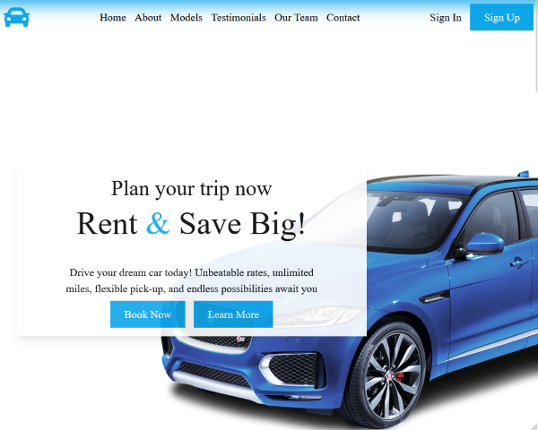
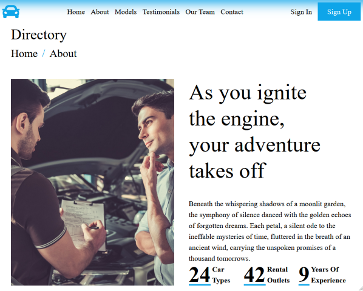

# Car Rental Service Frontend

This is the frontend of a **Car Rental Service** web application built using [Vite](https://vitejs.dev/), [React](https://reactjs.org/), and [Tailwind CSS](https://tailwindcss.com/). The purpose of this project is to provide users with a sleek, responsive, and efficient interface to browse and rent cars online. In future iterations, the backend will be implemented to allow users to book rentals, manage reservations, and handle payments.

### Live Demo ###

View the live demo of the application:

[Car Rental Service](https://samuelmevik.github.io/car-rental/)

### Screenshots ###




### Technologies Used ###

 - **TypeScript** Superset of JavaScript that adds static types.
 - **Vite** For fast development and optimized build processes. 
 - **React** JavaScript library for building user interfaces.  
 - **Tailwind CSS** Utility-first CSS framework for styling.
 - **React Router** Declarative routing for React applications.

### Features ###

  - **Responsive Design** Mobile-first design that scales to all screen sizes.
  - **Car Catalog** Browse a list of available cars with images and details.
  - **Car Details** View detailed information about a specific car.
  - **Informational Pages** Access the About and Contact pages etc

### Installation ###

1. Clone the repository:

```bash
git clone git@github.com:samuelmevik/car-rental.git
```

2. Navigate to the project directory:

```bash
cd car-rental
```

3. Install the dependencies:

```bash
npm install
```

4. Start the development server:

```bash
npm run dev
```

5. Open the browser and navigate to `http://localhost:5173/car-rental/` to view the application.

### Future Work ###

 - **Backend Integration** Implement a backend to handle user authentication, car reservations, and payments.
 - **User Authentication** Allow users to create accounts, log in, and manage their reservations.
 - **Car Reservations** Enable users to book cars for specific dates and times.
 - **Payment Processing** Implement a payment gateway to handle transactions securely.
 - **Admin Dashboard** Create an admin interface to manage cars, users, and reservations.